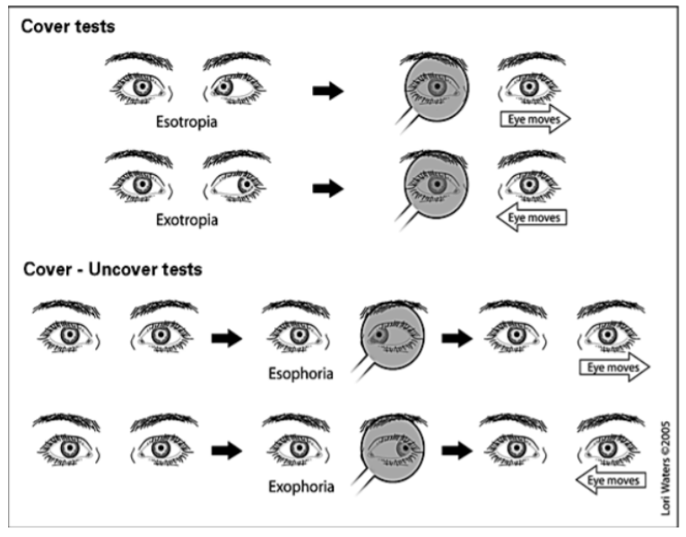

- The alternate cover test is performed after the single cover test.
- For this test, the examiner occludes one eye and then the other, switching the occluder back and forth to occlude the eyes without allowing the patient to fuse in between occlusion
- The alternate cover test is the most dissociative cover test and measures a total deviation, including the tropic plus the phoric/latent component.
- When performing the alternate cover test it is important to hold the occluder over each eye for at least a few seconds, in order to allow the non-occluded eye enough time to pick up fixation. In general, the
  faster the eyes can recover when the occluder is switched, the better the control of the deviation.
- 
- Resources
  background-color:: #497d46
  heading:: true
	- Youtube video demonstration of cover-uncover and cover-cross-cover tests: https://www.youtube.com/watch?v=TxEQWtlXtrI