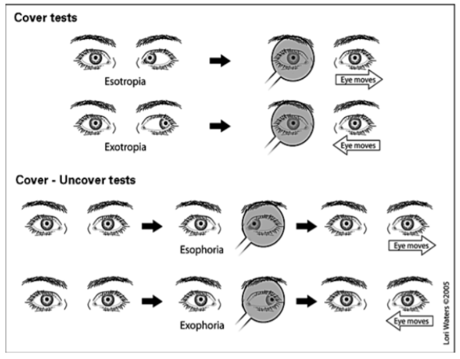

Alias:: Single Cover, Single cover test, cover uncover, cover-uncover test

- An alignment test to identify a tropia
- # Instructions
	- starts with 1 eye blocked BUT when you uncover, the patient has binocular vision
	- While patient is in sitting and head is stationary, ask the patient to look at a target approximately 30 cm (12”) from their face (this is near point convergence (NPC) while 6 to 10 meters is a distant target).
	- Cover one eye and look for any movement in the non-covered eye.
- # Images/ Diagrams/ Videos
- # Interpretation
-
- Note if the uncovered eye remains stationary or moves:
	- inward (exotropia)
	- moves outward (esotropia)
	- moves upward (hypotropia)
	- moves downward (hypertropia)
	- Record as “Normal” if the eye remains stationary or “Abnormal” if any of the above corrections are made.
	-
	  

<a href="https://www.360neurohealth.com/courses/certificate-of-competency-in-vestibular-rehabilitation-course-ccvr/lectures/36795242?wvideo=w9qp9j1tjb">Lab Demo Videos | 360 Neuro Health</a>

-
- 
- Resources
  background-color:: #497d46
  heading:: true
	- Youtube video demonstration of cover-uncover and cover-cross-cover tests: https://www.youtube.com/watch?v=TxEQWtlXtrI