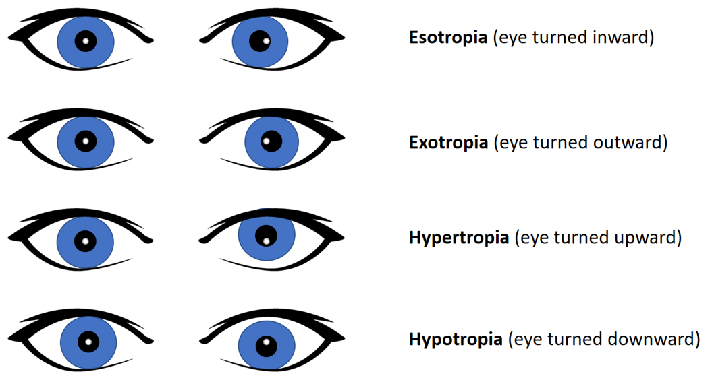

- At rest- identifies the presence of a tropia
	- [[Eye alignment at rest]]-
	- [[Pen light test]]
	- [[Cover-uncover]]
	- [[Cover-cross-cover]] Identifies a phoria – binocular vision is not available
	- 
	-
- |Eye Alignment     | At Rest | Cover-uncover | Cover-cross-cover |
  | ---------------- | ----------- | --------|  --------| 
  | Esotropia     | eye(s) turn inward   | non-covered eye moves outward | -| 
  | Exotropia  | eyes(s) turn outward   | non-covered eye moves inward | -| 
  | Hypertropia | eye(s) turn upward   | non-covered eye moves downward | - | 
  |Hypotropia | eye(s) turn downward   | non-covered eye moves upward | -| 
  | Esophoria     | - | -|  covered eye moves outward when uncovered |
  | Exophoria  | -   | -|  covered eye moves inward when uncovered |
  | Hyperphoria| -   | - |  covered eye moves down when uncovered |
  |Hypophoria| -  | -|  covered eye moves up when uncovered |
	-
	-