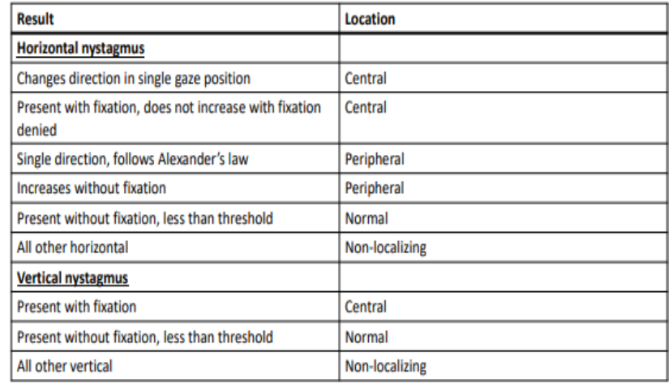

- Keep patient’s head stationary. Patient looks straight ahead. Observe for nystagmus.
- Record as “negative” for normal or “positive” if nystagmus noted. If present, describe the characteristics:
	- [[Shape]]
	- [[Direction]]
	- [[Intensity]]
	- [[fixation]]
- [[Peripheral vestibular nystagmus]] typically horizontal, decreases with fixation, increases when patient looks in direction of the fast phase
- Note: [[congenital nystagmus]] will typically increase w/fixation; decrease with convergence and there is typically a “null” point (an area the patient can look and stop the nystagmus).
-  (Dr. Bogle, 2019)
-